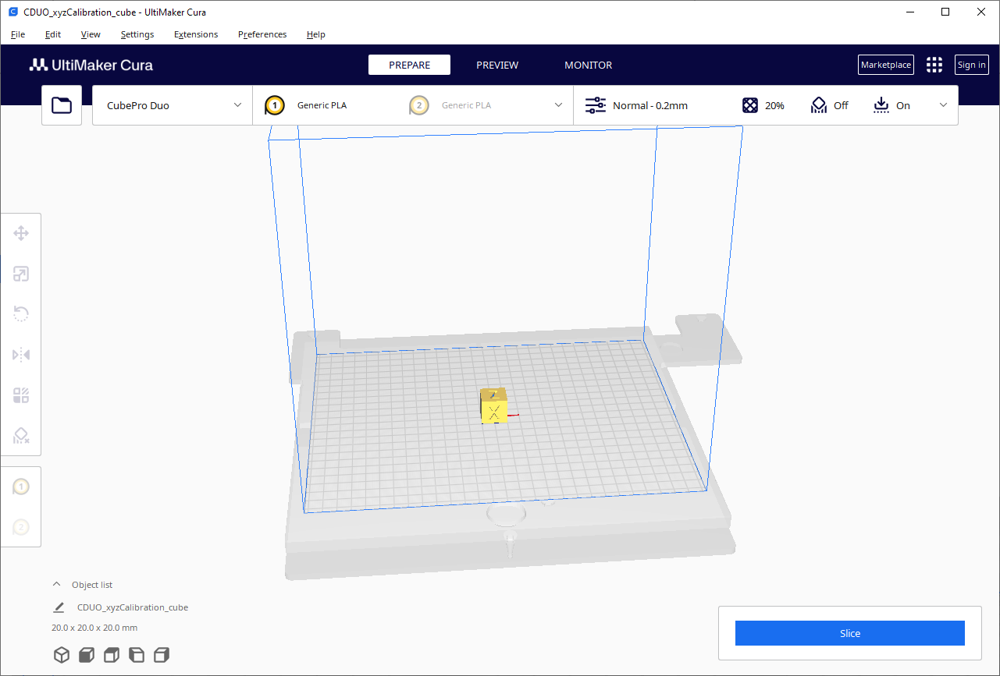

# Cura-CubeProPrinterPlugin

https://github.com/mirdoc/Cura-CubeProPrinterPlugin/

This is a plugin for [Cura](https://ultimaker.com/en/products/ultimaker-cura-software) that adds the 3D Systems CubePro, CubePro Duo, and CubePro Trio printers to Cura and enables Cura to export to the proprietary 3D Systems .cubepro file format.

# <a name="Table_Of_Contents"></a>Table Of Contents
- [Introduction](#Introduction)
- [Installation Instructions](#Installation)
- [Using the Plugin](#Using_the_Plugin)
- [Note](#Note)
- [Frequently Asked Questions (FAQ)](#FAQ)
- [Technical Details of the .cubepro File Format](#Technical_Details)
- [License](#License)

# <a name="Introduction"></a>Introduction
This software is released as a plugin for the [Ultimaker Cura](https://ultimaker.com/en/products/ultimaker-cura-software) Software.  The Cura-CubeProPrinterPlugin contains the necessary printer files to add the 3D Systems CubePro, CubePro Duo, and CubePro Trio printers to Cura and enables Cura to export the proprietary .cubepro file format.

The author of this software is not affiliated with 3D Systems or Ultimaker.  Although the software functions well for the author and many other users, it is released without guarantee.  Using the software and the files that it produces may damage your printer, set property on fire, or do other **really_bad_things**.  

This software is supplied without warranty and the user is responsible if they use this software and injury happens to their person or any other persons or damage occurs to any property as a result of using this software and/or the files that it creates.  Please remain near the 3D printer while using files generated by this software, and pay close attention to the 3D printer while it is on to verify that the machine is functioning properly. The software is provided AS-IS and any usage of this software or its output files is strictly at the user's own risk. The developer makes no other warranties, express or implied, and hereby disclaims all implied warranties, including any warranty of merchantability and warranty of fitness for a particular purpose.

This plugin borrows heavily from the [Cura-Dremel-Printer-Plugin Cura gcode writer plugin](https://github.com/metalman3797/Cura-Dremel-Printer-Plugin) which itself contains code that is based upon the [Cura gcode writer plugin](https://github.com/Ultimaker/Cura/tree/master/plugins/GCodeWriter) and is released under a LGPL-3.0 license.  Source code for this plugin can be found [here](https://github.com/mirdoc/Cura-CubeProPrinterPlugin).



As this plugin is currently in the testing stages it is not yet available within the Cura Marketplace.  Whilst this will hopefully change in the near future, for the timebeing the plug-in can be installed using the package available through the release page on this plugin's website.

This plugin was written for Cura 5.6 and has been tested on Windows 10 Professional 64 bit edition, but should work equally well on any other operating system that Cura supports.

---

# <a name="Installation"></a>Installation

To install the plugin, follow the instructions below:

1.  [Download and install Cura](https://ultimaker.com/en/products/ultimaker-cura-software) on your machine 

2.  [Download the latest plugin package](https://github.com/mirdoc/Cura-CubeProPrinterPlugin/releases) from the plugin release page

3. Open Cura and drag and drop the plugin file *CubeProPrinterPlugin-x.x.x.curapackage* into the Cura window

4. Cura will display a message telling you the plugin will be installed after restarting
    

5.  Close the Cura application and re-launch Cura

6.  Upon restart you should have an option to add a CubePro, CubePro Duo, and CubePro Trio printers (see "Using the Plugin" section below) - Congratulations, the plugin is now installed!

---
# <a name="Using_the_Plugin"></a>Using the Plugin
To add your printer to use in Cura follow the steps outlined below:
1. Open Cura and navigate through the menu to Settings -> Printer -> Add Printer to open the Add Printer Window

2. Click the "Non Ultimaker printer" button
    
    
3. Click the "Add a non-networked printer" button
    
    
4. Scroll down to the "3D Systems" category, select your CubePro printer, and click the "Add" button
    

5. You have now installed a CubePro printer, your Cura should look something like this:
    
    

To print a model follow the steps outlined below:
1. Open Cura and use the File menu to open a model file to print

2. Ensure your CubePro printer is selected and choose the type of filament you're using in your printer
    

3. Set the slicing options that you want from the print settings in the upper right corner of the screen
    
    
4. Press the slice button in the lower-right corner to tell Cura to slice the object using the selected settings
    
    
5. Click the "save to file" or "save to removable drive" button.  Ensure that .cubepro is chosen as the output file format
    
    
    
    
    
   **Note:** Saving a .cubepro can take several seconds or longer depending on the size and complexity of the object you are printing. Please be patient and wait for the message that tells you that the file has been saved. 

6. Save or copy this file to a removable USB drive

7. Insert the removable drive into your CubePro printer's USB port

8. Turn on the printer

9. Select "Print" and choose the appropriate file to print 

10. Enjoy - if you encounter issues, feel free to raise them in the ["Issues" section](https://github.com/mirdoc/Cura-CubeProPrinterPlugin/issues/new)

---
# <a name="Note"></a>Note
Please note the following:
* This plugin has been tested using the latest version of Cura noted in this README on Windows 10 x64 but testing and feedback for other platforms is welcomed!
* This plugin has been tested to work in the basic print case, however users may (and probably will) encounter problems with complex printing tasks and/or when using changing from default print settings. If you encounter any issues with the plugin, feel free to [raise an issue](https://github.com/mirdoc/Cura-CubeProPrinterPlugin/issues/new).

---
# <a name="FAQ"></a>Frequently Asked Questions
1. **Question:** *I have encountered a problem with this plugin, what should I do?*
   **Answer:**   This plugin is very much a work-in-progress and should be considered experimental.  Feel free to raise any problems or issues encountered in the ["Issues" section](https://github.com/mirdoc/Cura-CubeProPrinterPlugin/issues/new).

2. **Question:** *Does this plugin support USB-connected printing/Octoprint/Wifi Printing?  Do I need an SD card/USB thumb drive?*
   **Answer:** The plugin only supports creating .cubepro files and using a removable USB drive to get the files into the printer.  It does not currently support direct USB or WiFi communication with the printer.  The author may consider adding Wifi support in the future if enough users request this.

3. **Question:** *I'm using an older version of Cura, can I use this plugin?*
   **Answer:** This plugin has been written for the latest version of Cura.  At this stage there are no plans to provide support for older versions of Cura.

4. **Question:** *What print materials/settings are supported?*
  **Answer:**  The author has tested the settings for generic PLA and ABS.  Testing of other materials and settings is very much encouraged and the author would appreciate feedback so this document can be updated with more information about material/setting compatibility or incompatibility.  If you have any suggested improvements to the settings please submit a Github issue or Pull Request and the changes will get tested.

---
# <a name="Technical_Details"></a>Technical Details of the .cubepro File Format
There are essentially two different versions of the .cubepro file format which will be referred to as the old format and the new format.  

The old format is simply a g-code text file encrypted using the BlowFish ciper using the encryption key *"221BBakerMycroft"*

The new format is essentially several files bundled together in a simple uncompressed archive.  Included in this archive is a Blowfish encrypted g-code text file which is produced in the exact same manner as the old file format.  However, after CubePro v1.87 3D Systems seems to have revised the way that the g-code is stored and encrypted.  Attempting to decrypt it in the usual fashion only generates approximately 20 lines of readable g-code while the remainder of the file appears jumbled.

For simplicity and compatibility this plugin generates files using the old format as all CubePro printer firmware versions are able to read and process these files.

This is the first 288 bytes of a new format .cubepro file.  A description of the current understanding of this file format is below:

Offset   | Binary Data                                      | ASCII           |
---------|--------------------------------------------------|-----------------|
`00000000`|`06 00 00 00 82 b0 04 00 08 01 7c 06 00 00 69 6e` |`....‚°....\|...in`|
`00000010`|`64 65 78 2e 78 6d 6c 00 00 00 00 00 00 00 00 00` |`dex.xml.........`|
`00000020`|`00 00 00 00 00 00 00 00 00 00 00 00 00 00 00 00` |`................`|
`00000030`|`00 00 00 00 00 00 00 00 00 00 00 00 00 00 00 00` |`................`|
`00000040`|`00 00 00 00 00 00 00 00 00 00 00 00 00 00 00 00` |`................`|
`00000050`|`00 00 00 00 00 00 00 00 00 00 00 00 00 00 00 00` |`................`|
`00000060`|`00 00 00 00 00 00 00 00 00 00 00 00 00 00 00 00` |`................`|
`00000070`|`00 00 00 00 00 00 00 00 00 00 00 00 00 00 00 00` |`................`|
`00000080`|`00 00 00 00 00 00 00 00 00 00 00 00 00 00 00 00` |`................`|
`00000090`|`00 00 00 00 00 00 00 00 00 00 00 00 00 00 00 00` |`................`|
`000000A0`|`00 00 00 00 00 00 00 00 00 00 00 00 00 00 00 00` |`................`|
`000000B0`|`00 00 00 00 00 00 00 00 00 00 00 00 00 00 00 00` |`................`|
`000000C0`|`00 00 00 00 00 00 00 00 00 00 00 00 00 00 00 00` |`................`|
`000000D0`|`00 00 00 00 00 00 00 00 00 00 00 00 00 00 00 00` |`................`|
`000000E0`|`00 00 00 00 00 00 00 00 00 00 00 00 00 00 00 00` |`................`|
`000000F0`|`00 00 00 00 00 00 00 00 00 00 00 00 00 00 00 00` |`................`|
`00000100`|`00 00 00 00 00 00 00 00 00 00 00 00 00 00 00 00` |`................`|
`00000110`|`00 00 3c 3f 78 6d 6c 20 76 65 72 73 69 6f 6e 3d` |`..<?xml version=`|

**Header**
* `06 00 00 00` = four-byte little-endian uint which is presumably a version number, possible values are 0x00000006 in files generated by CubePro version <= 1.87 and 0x00000007 in files generated by CubePro version > 1.87
* `82 b0 04 00` = four-byte little-endian uint containing total size of the file in bytes
* `08 01` = two-byte little-endian ushort containing the offset in the file of the first file in the archive5. `b0 38 00 00` = four-byte little-endian uint containing the offset in the file to the start of the gcode

**File Block**
* `7c 06 00 00` = four-byte little-endian uint containing the size in bytes of a file in the archive
* `69 6e 64 65 78 2e 78 6d 6c 00 00 ...` = 260 character null padded string containing the name of a file in the archive
* `3c 3f 78 6d 6c 20 76 65 72 73 69 6f 6e 3d ...` = array of bytes containing the data of a file in the archive

There can be any number of *File Blocks* stored until EOF is reached.

The files typically stored in a .cubepro are as follows:

Filename | Description |
---------|-------------|
index.xml|Print information file in XML format that contains a number of print settings, materials used, extruder configuration, and details of the other files included in the archive.  A sample index.xml is included below.|
*.cubepro|Plain text file containing g-code which is encrypted with Blowfish cipher. This file has the same name as the .cubepro archive|
isoimage.png|Isometric view of the print in PNG format.|
frontimage.png|Front view of the print in PNG format.|
frontimage.png|Front view of the print in MRL^ format.|
frontimage_g.mrl|Front grayscale view of print in MRL^ format.|

**Note: ^** MRL files are image files used by the CubePro's firmware to display images on the printer's LCD screen

**Sample File: index.xml**
```xml
<?xml version="1.0" ?>
<build_package>
    <build>
        <type>cubepro</type>
        <version>1494</version>
        <build_file>printfile.cubepro</build_file>
        <build_crc32>3809665710</build_crc32>
        <preview_isometric>isoimage.png</preview_isometric>
        <preview_elevation>frontimage.mrl</preview_elevation>
        <preview_elevation_greyscale>frontimage_g.mrl</preview_elevation_greyscale>
        <preview_elevation_large>frontimage.png</preview_elevation_large>
        <materials>
            <extruder1>
                <code>209</code>
                <length>0</length>
                <recycled>0</recycled>
                <weight>6.76858</weight>
            </extruder1>
            <extruder2>
                <code>-1</code>
                <length>0</length>
                <recycled>0</recycled>
                <weight>0</weight>
            </extruder2>
            <extruder3>
                <code>-1</code>
                <length>0</length>
                <recycled>0</recycled>
                <weight>0</weight>
            </extruder3>
        </materials>
        <preview_elevation_filled_percent>100</preview_elevation_filled_percent>
        <build_time>16</build_time>
        <build_style>1</build_style>
        <layer_count>98</layer_count>
        <layer_height>0.2</layer_height>
        <hatch_pattern>1</hatch_pattern>
        <supports>-1</supports>
        <rafts>-1</rafts>
        <sidewalk>-1</sidewalk>
        <x_extents>20</x_extents>
        <y_extents>20</y_extents>
        <z_extents>19.8</z_extents>
    </build>
</build_package>
```

---
# <a name="License"></a>License
The Cura-CubeProPrinterPlugin is licensed under the GNU Lesser General Public License v3.0

Permissions of this copyleft license are conditioned on making available complete source code of licensed works and modifications under the same license or the GNU GPLv3. Copyright and license notices must be preserved. Contributors provide an express grant of patent rights. However, a larger work using the licensed work through interfaces provided by the licensed work may be distributed under different terms and without source code for the larger work.

For the complete license text, please see the [LICENSE file](https://github.com/mirdoc/Cura-CubeProPrinterPlugin/blob/stable/LICENSE)
